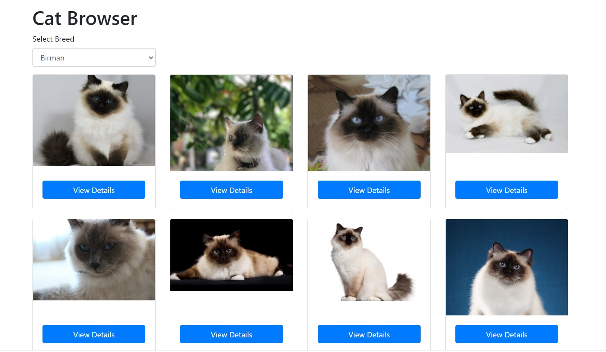

# React Cat Browser

> A simple react app that enable users to find and select different breed of cats.

An open source project that makes simple API call built with **React Hooks & Context API** as a state manager.

The API used on this project is [thecatapi.com](https://docs.thecatapi.com).



## Dependencies

- react-router-dom
- react-bootstrap
- axios
- Context API (state management)

## Features

- Homepage Dropdown Search
- Load More Button
- Single Page Preview

## Usage

##### Clone the project

```
git clone https://github.com/ivanhular/react-cat-brower.git
```

##### Install dependencies

```
npm install
```

##### Run

```
npm start
```

## Release History

- 0.0.1
  - Added All features

## Meta

John Ivan Hular – [ivanhular@gmail.com](mailto:ivanhular@gmail.com)

Distributed under the XYZ license. See `LICENSE` for more information.

[https://github.com/ivanhular](https://github.com/ivanhular)
